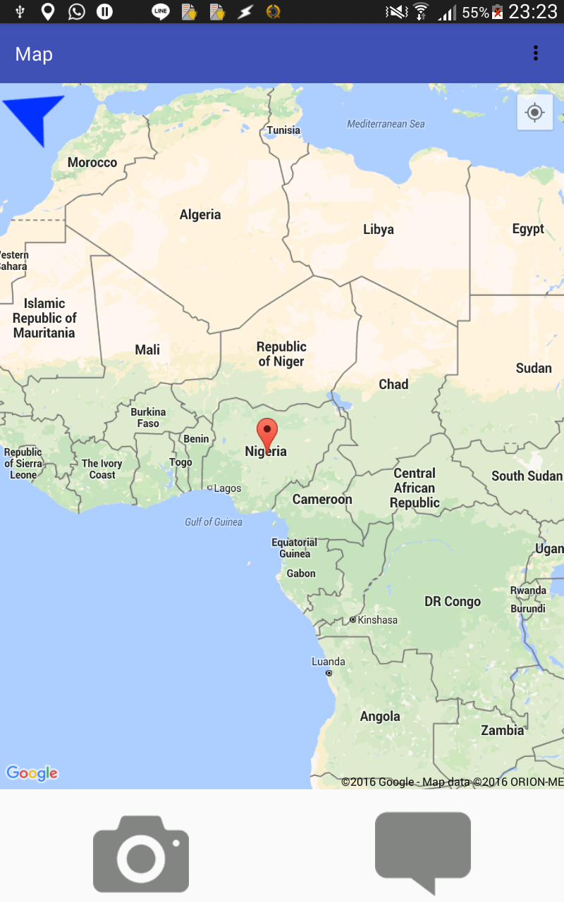
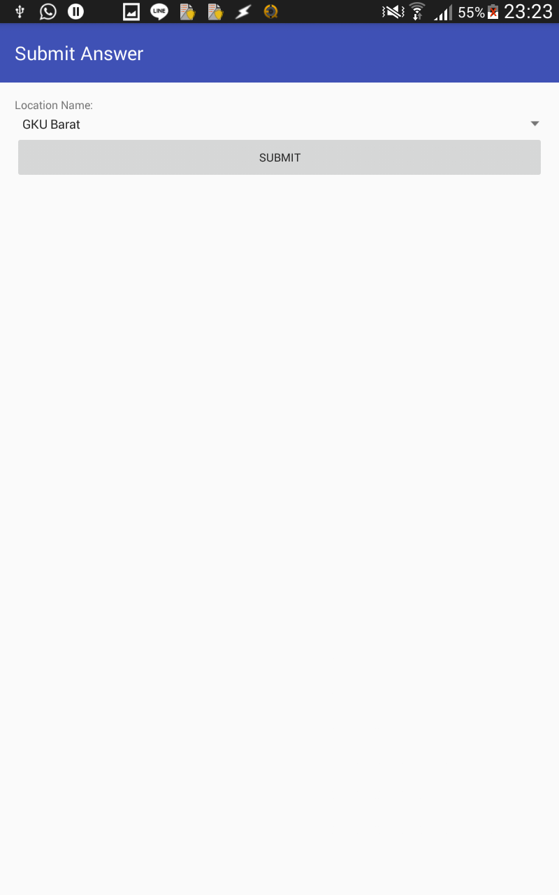
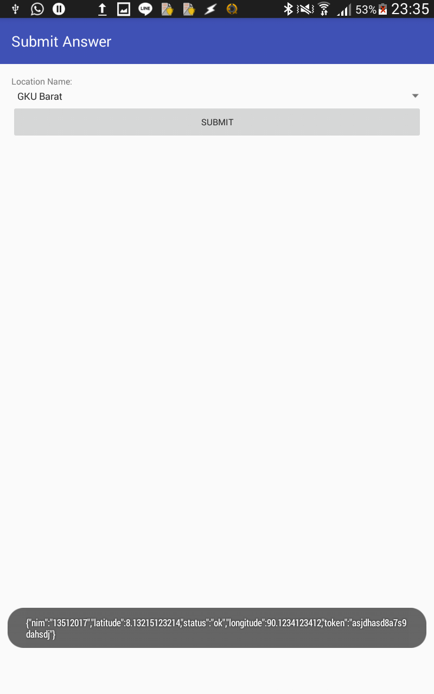

# Mappie
Tugas Besar I IF3111
Android App mencari lokasi-lokasi di ITB dari lokasi yang diberikan oleh server. Pengguna dapat:
* melihat marker lokasi yang diberikan server
* mendapatkan reply dari server berbentuk Toast
* menggunakan intent kamera native dari aplikasi
* mengetahui arah utara dari kompas

### Screenshots
#### Map
Memperlihatkan halaman utama yang berisi Google maps dan marker untuk lokasi pertama.

#### Submit
Submit page untuk memberikan jawaban

Toast akan diberikan setiap ada response dari server

[src](http://gitlab.informatika.org/ariezanadya/Tubes1-Android/tree/master/app/src/main/java/com/example/atia/tubes1android)
[apk](http://gitlab.informatika.org/ariezanadya/Tubes1-Android/tree/master/apk-debug.apk)

Arieza Nadya/13512017