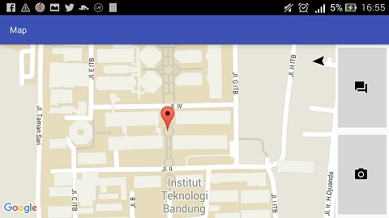

# Tugas Besar 1 IF3111 Pengembangan Aplikasi pada Platform Khusus

## Deskripsi Aplikasi

Aplikasi ini digunakan untuk menemukan beberapa tempat di lingkungan ITB. Aplikasi ini akan terkoneksi dengan server, kemudian server tersebut akan mengirimkan sebuah lokasi dalam bentuk *latitude* dan *longitude*. Aplikasi kemudian akan mengolah data lokasi tersebut dan kemudian menampilkan lokasi tersebut dalam peta. Tugas kita adalah untuk menemukan lokasi tersebut, kemudian kita diminta untuk foto-firi di lokasi dan mengirimkan jawaban berupa nama lokasi tempat tersebut.

Daftar kemungkinan jawaban lokasi adalah

* gku_barat
* gku_timur
* intel
* cc_barat
* cc_timur
* dpr
* sunken
* perpustakaan
* pau
* kubus

## Spesifikasi Aplikasi

Spesifikasi dari aplikasi yang dibangun sebagai berikut

* Aplikasi mampu menerima pesan dari server dengan format JSON berisi lokasi dan token.
* Aplikasi mampu mengolah data berupa location point (longitude, latitude) dan menampilkan indicator pada peta lokasi yang dimaksud. Peta lokasi menggunakan Google Map API. (Tampilan silahkan lihat Spesifikasi Tampilan).
* Terdapat sebuah panah navigasi yang berada diatas peta (letak bebas), yang menunjukan arah utara. Anda diminta menggunakan sensor yang ada pada android API (Tampilan silahkan lihat Spesifikasi Tampilan).
* Aplikasi mampu mengirim intent kamera.
* Aplikasi mampu mengambil gambar melalui kamera. Gambar tidak perlu diunggah ke server (silakan lihat spesifikasi tanya jawab asisten)
* Aplikasi mampu mengirimkan pesan ke sever dengan format JSON berisi lokasi (longitude, latitude), nim serta token.
* Pastikan SDK anda mendukung pengerjaan tugas ini.
* Perhatikan tata letak tombol. Ketika orientasi layar portrait, tombol berada pada bawah layar. Ketika landscape, tombol berada pada samping kanan layar (lihat contoh tampilan seperti pada mock-up spesifikasi tampilan). Anda dapat menggunakan fragment untuk masalah ini.
* Tampilan warna, font, style tidak dinilai. Namun tata letak tombol akan dinilai.
* Hasil reply dari server harus ditampilkan dalam bentuk *toast* atau *alert dialog* (pilih satu).
* Ketika anda menggunakan activity yang memanggil sensor, sensor tersebut harus dilepas ketika anda berpindah activity agar tidak boros baterai.


## Spesifikasi Pertukaran Pesan
Keterangan : *Client* pada dokumen ini adalah aplikasi Anda dan *Server* merupakan server milik asisten.
### Request Location
Permintaan lokasi (pertama).

**Client Request**
```sh
{“com”:”req_loc”,”nim”:”13512999”}
```
**Server Response** 
```sh
{“status”:”ok”,”nim”:”13512999”,”longitude”:”6.234123132”,”latitude”:”0.1234123412”,”token”:”21nu2f2n3rh23diefef23hr23ew”}
```
### Send Answer
Mengirimkan jawaban dan menerima lokasi berikutnya

**Client Request**
```sh
{“com”:”answer”,”nim”:”13512999”,”answer”:”labtek_v”, ”longitude”:”6.234123132”,”latitude”:”0.1234123412”,”token”:”21nu2f2n3rh23diefef23hr23ew”}
```
**Server Response**
Jika jawaban Anda **benar**, maka:
```sh
{“status”:”ok”,”nim”:”13512999”,”longitude”:”8.13215123214”,”latitude”:”9.1234123412”,”token”:”124fewfm32r32ifmwder42”}
```
Jika jawaban Anda **salah**, maka:
```sh
{“status”:”wrong_answer”,”nim”:”13512999”,”token”:”124fewfm32r32ifmwder42”}
```
Jika jawaban Anda **benar dan sudah berada dilokasi ketiga**, maka:
```sh
{“status”:”finish”,”nim”:”13512999”,”token”:”124fewfm32r32ifmwder42”,”check”:1}
```
## Tampilan Aplikasi

**Tampilan horizontal**


**Tampilan vertikal**



**Tampilan *submit* jawaban**


## Lokasi Source Code
Source Code untuk aplikasi ini terdapat pada folder `MapApp`. Folder tersebut merupakan Android Studio Project yang dapat dibuka di Android Studio.

## Lokasi Binary File
Binary file (apk) aplikasi ini terdapat pada direktori `apk`.

[Markdown]: <http://dillinger.io/>