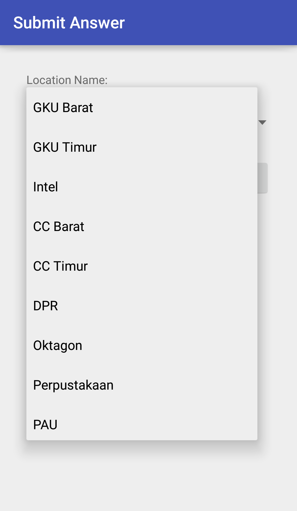

# Project 1 - Android - IF3111 Platform-based Application Development
## 13513021 - Erick Chandra

In IF3111 course, all students have to accomplish the app completion within certain deadline. The original specification is available [here] (in Bahasa Indonesia).

This application mainly have the functionality of guessing the places in Bandung Institute of Technology. There are 10 places for guessing:
- GKU Barat
- GKU Timur
- Intel
- CC Barat
- CC Timur
- DPR
- Oktagon (changed; previously Sunken)
- Perpustakaan
- PAU
- Kubus

Inside the application, it must communicate with the server (provided by lab assistants) and have certain communication convention such as follows.

**Location Request**

These are the client and server communication via JSON string passed by socket connection.

***First Client Request***
```sh
{“com”:”req_loc”,”nim”:”13513021”}
```

***First Server Request***
```sh
{“status”:”ok”,”nim”:”13513021”,”longitude”:”6.234123132”,”latitude”:”0.1234123412”,”token”:”21nu2f2n3rh23diefef23hr23ew”}
```

***Send Answer (Client to Server)***
```sh
{“com”:”answer”,”nim”:”13513021”,”answer”:”labtek_v”, ”longitude”:”6.234123132”,”latitude”:”0.1234123412”,”token”:”21nu2f2n3rh23diefef23hr23ew”}
```

***Server Response (if the answer is correct)***
```sh
{“status”:”ok”,”nim”:”13513021”,”longitude”:”8.13215123214”,”latitude”:”9.1234123412”,”token”:”124fewfm32r32ifmwder42”}
```

***Server Response (if the answer is incorrect)***
```sh
{“status”:”wrong_answer”,”nim”:”13513021”,”token”:”124fewfm32r32ifmwder42”}
```

***Server Response (if the client has reached the third correct answer therefore finish)***
```sh
{“status”:”finish”,”nim”:”13513021”,”token”:”124fewfm32r32ifmwder42”,”check”:1}
```

> Important: The given token must be used when making the next reply. Otherwise it will be an error.

## Detailed Application Specification
* Application must be able to receive message from the server with JSON format, containing location (latitude and longitude) and token.
* Application must be able to calculate location point (latitude and longitude) and show the location indocator on the map view. The map will be implemented with Google Map API.
* There is a navigation arrow located on the map. The default direction is North. In order to implement this, sensors might be utilised.
* Application must be able to send camera intent.
* Photo could be taken but it is not compulsory to upload the photo to the server.
* Applicationmust be able to send message to the server with JSON format containing location information (latitude, longitude), Student ID, and token.
* Use of supporting SDK for this project.
* For some view, there are some differences when rotating the orientation (landscape vs portrait).
* Colours, fonts, and styling are not included in major marking. However, button position on the screen is important.
* Server replies must be shown with Toast or Alert Dialogue.
* Whenever the app uses the sensor, it must release all sensors by the time the user leaves the activity to reduce unnecessary battery consumption and to avoid some performance issues.

## Screenshots

**App Launcher**


**Home Activity**


**Map Activity**


**Map Activity (Landscape Mode)**


**Calling Camera Intent**


**Submission Activity**


**Submission Spinner Drop Down**



**Message Toast**


## Source Code Folder Path

```sh
~/Tubes1-Android/app/src/main/
```

## Binary Built APK Folder Path

```sh
~/Tubes1-Android/apk/
```

   [here]: <http://gitlab.informatika.org/IF3111/Tubes1-Android>
