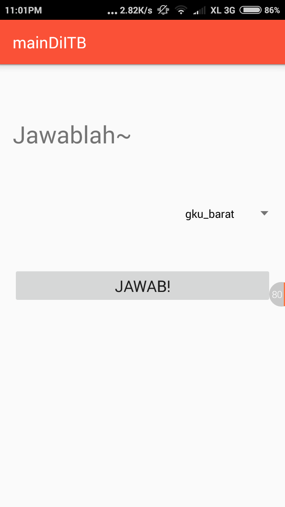

<<<<<<< HEAD
# mainDiITB

mainDiITB adalah sebuah perangkat lunak berbasis Android yang bertujuan untuk memenuhi tugas besar mata kuliah IF3111 Pengembangan Aplikasi pada Platform Khusus.

### Versi
1.0

### Screenshot

#### Halaman Utama
Halaman ini akan terbuka pertama kali saat aplikasi digunakan

#### Halaman Jawaban
Halaman ini akan terbuka ketika ingin mengirim jawaban pada server setelah lewat peta

#### Halaman Peta
Halaman ini berisi peta dan 2 tombol untuk memanggil kamera serta menampilkan halaman jawaban

#### Toast!
Akan muncul sebuah toast ketika server mengembalikan berbagai nilai

### Fitur

Fitur yang ada pada mainDiITB adalah 
* Menampilkan peta sesuai Latitude dan Longitude yang diberikan server
* Memanggil kamera langsung dari aplikasi
* Menunjukkan arah utara pada layar peta
* Memberi notifikasi toast untuk tahu respon dari server secara langsung

### Download File APK

[APK](apk/mainDiITB.apk)

### Kontributor

`Bimo Aryo Tyasono` `13513075`

License
----

MIT

**Free Software!**

=======
# IF3111-2016-Tugas1-Android
>>>>>>> 099a80cba97c50ea788525b655f4ab9669133a24
